#### Title
Predicting UK GQ education malpractice cases (%) by exam board (multivariate time series analysis), using public data.

#### Introduction
This project explores published UK secondary school education data, and performing a predictive data analysis, extending the data into the future.
The chosen dataset is similar in structure to one I use in my daily work, so besides demonstrating my data science skills, I can integrate my code with small modifications into my reporting to stakeholders, replacing a crude and flawed seven-day sliding window prediction.

#### Dataset
The data used in this project is public data, published by Ofqual. “All content is available under the Open Government Licence v3.0”, which means I can “use and re-use the Information that is available under this license freely and flexibly” [(The National Archives, 2019)](https://www.nationalarchives.gov.uk/doc/open-government-licence/version/3/) and include it into my work.

I used the dataset of Summary statistics for GCSE AS and A level [(Ofqual Analytics, n.d.)](https://analytics.ofqual.gov.uk/apps/GCSEandGCE/SummaryStats/), with data of the past seven years, which includes the period of the cancelled or modified summer examinations due to the Covid-19 pandemic. I merged the dataset I collected at the beginning of the project contained the years 2017-2023, with an updated version towards completing the project containing the years 2018-2024, which provided me with the data of eight years.

#### Process
In my day-to-day job, data sourcing and methods/tools/concepts used is driven by the business question. This project is the reverse as the dataset drives what research questions can be answered and what methods are suitable.

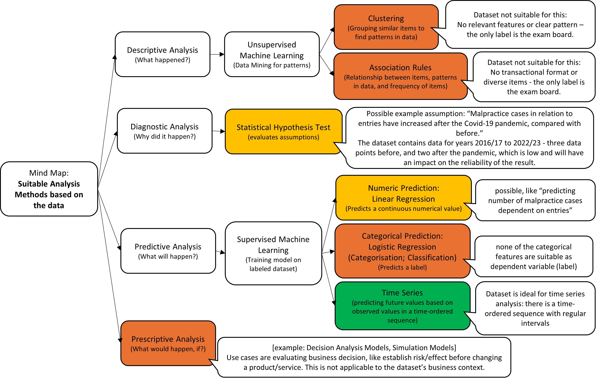

Image 1: Mind Map for selecting data analysis method

After evaluating the suitability of various analysis techniques for the dataset using mind mapping (image 1), I selected Time Series Analysis as it is the most relevant option for the dataset.

##### Methods, Techniques, Tools and Technologies
Before downloading the dataset, I read through information and documentation provided with the data by the provider, as well as the data usage policy.
I used Python code, especially the Pandas library, for the Data Quality Audit, and data manipulations, building the supervised machine learning model, and data visualization using libraries Matplotlib and Seaborn. This works well for larger dataset and the procedures are repeatable and easier to maintain, which helped me in rerunning the project after I created a new dataset with Ofqual’s updated version.

I created ETL Diagrams, Data & Process Workflow Illustrations, and Data Dictionaries for highlighting any bottlenecks or data processing challenges and helping to keep the project realization on track.

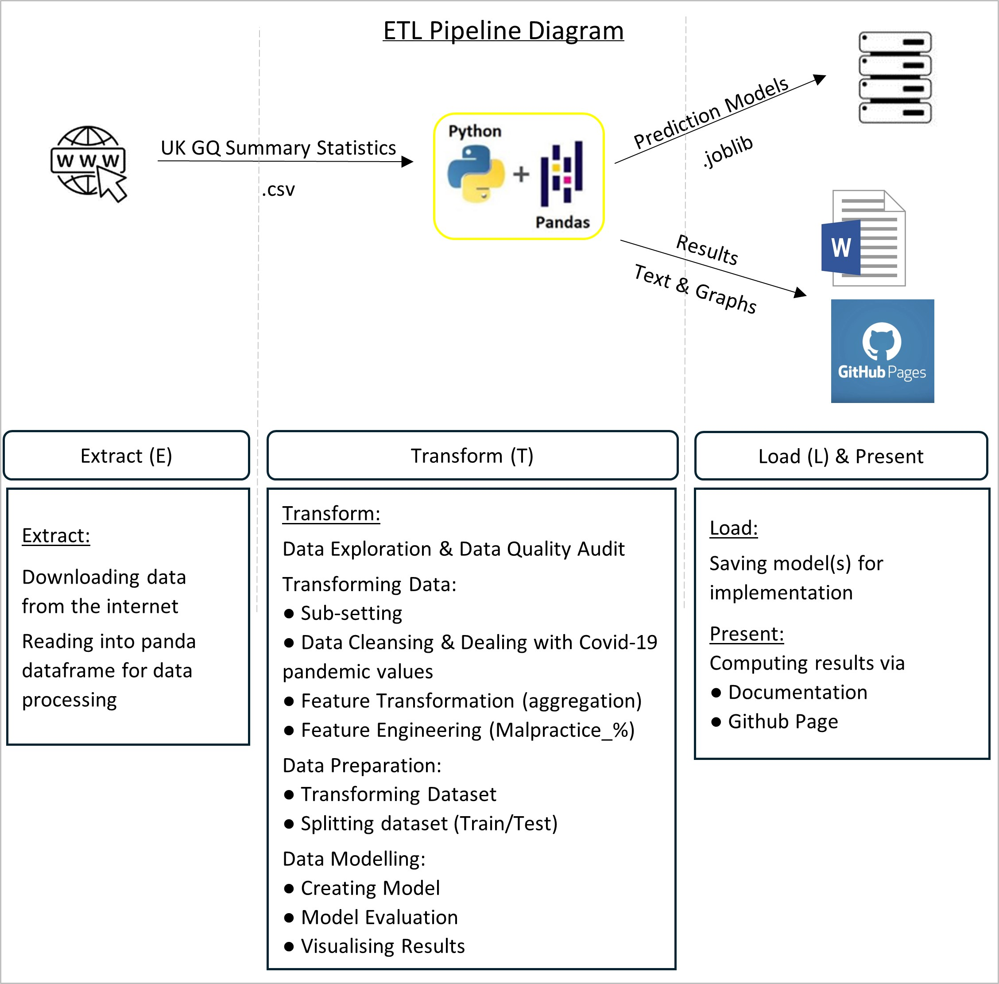

Image 2: ETL-Pipeline

The concept of the ETL data pipeline (image 2) in data engineering is of Extract (E), Transform (T), and Load (L) the data into a data depository for further use for analysis or presentation. 

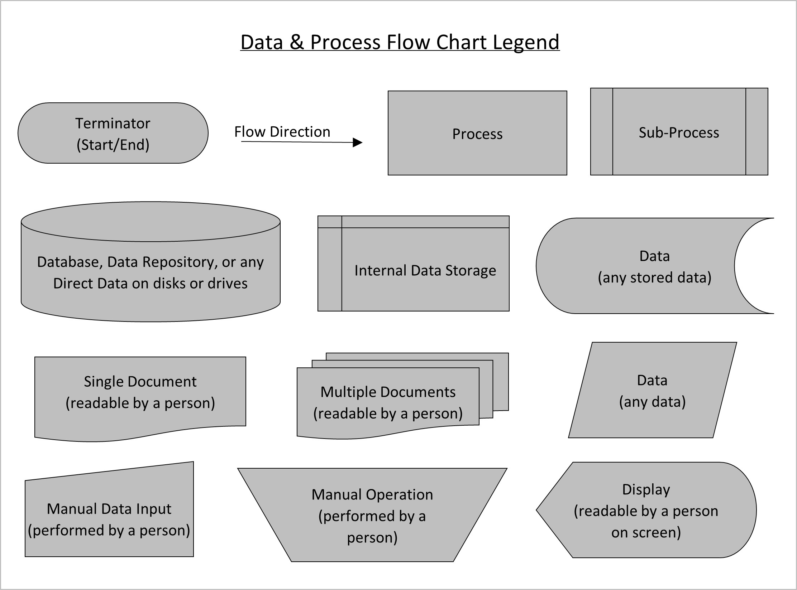

Image 3: Data & Process Flow Chart Legend

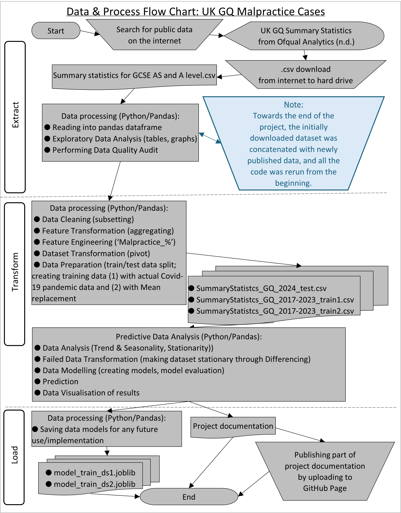

Image 4: Data & Process Flow Chart

The Data & Process Workflow Illustrations (image 3 and 4) provides details about each process step. 

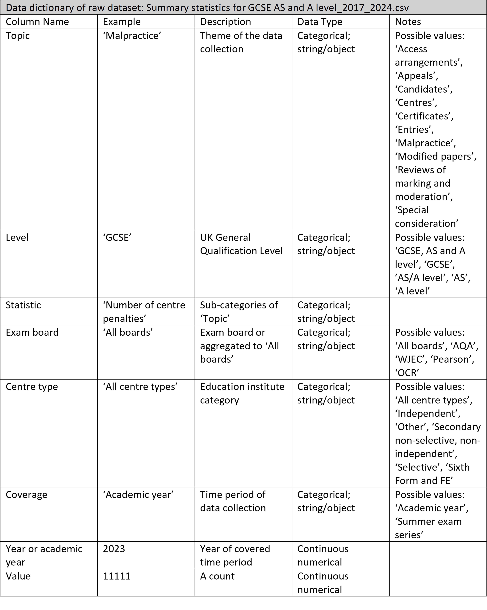

Image 5: Data-dictionary (raw dataset)

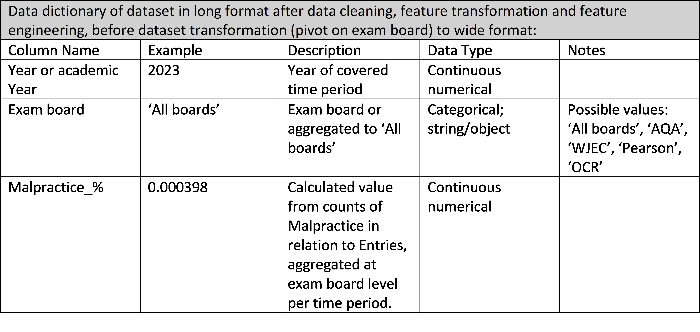

Image 6: Data-dictionary (cleaned dataset)

The Data Dictionaries (images 5 and 6) provides dataset key information, like variables, description and values, and datatype.

#### Analysis
##### Data Exploration & Data Quality
To get an understanding of the dataset I explored documentation and information provided by the data publisher.
Based on the six principles of Data Quality Dimensions [(Government Data Quality Hub, 2021)](https://www.gov.uk/government/news/meet-the-data-quality-dimensions), I performed a Data Quality Audit, for which I used methods and techniques of descriptive data analysis for data profiling and data exploration.

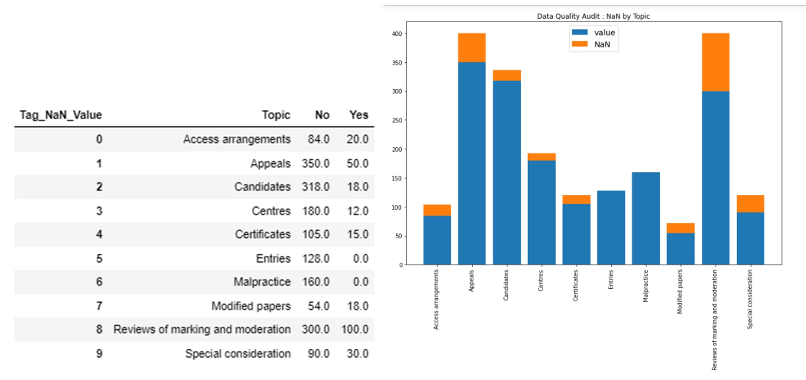

Image 7: Missing values by Topic

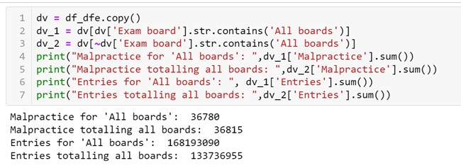

Image 8: Summarisation of values for all boards vs ‘All boards’

The part of the dataset relevant to my analysis were complete, meaning it had no missing values for the Topics ‘Malpractice’ and ‘Entries’ (image 7), but I found issues with consistency, meaning a conflict with other values within the dataset (image 8). Thus is, that when summarising the malpractice counts for the exam boards, it differs to the total provided under ‘All boards’. When comparing the summary report I am using with the original detailed datasets, I can see that ‘<5’ had been replaced with ‘5’ in the summary report. For my analysis I will use ‘All boards’ as another variable and not summarising results.

##### Feature Transformation
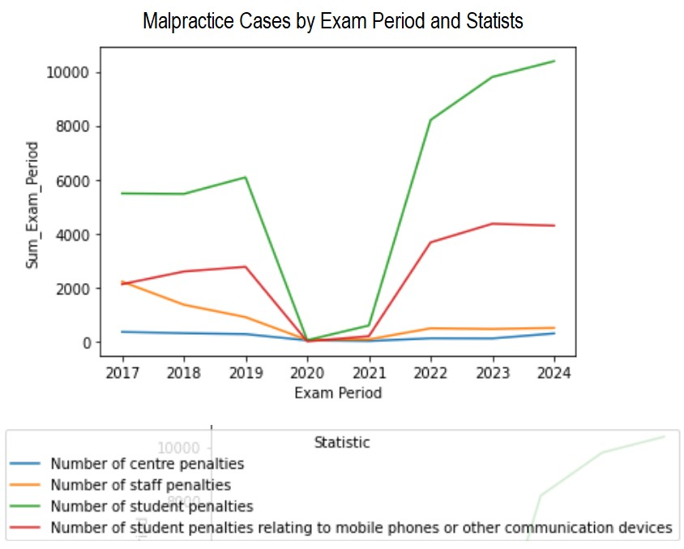

Image 9: Count of ‘Malpractice’ by its ‘Statistics’

While Malpractice cases are only displayed as summer series coverage, the dataset is more granular, as each ‘Topic’ is split up into sub-topics called ‘Statistics’ (image 5 and 9), so I filtered on and then aggregate the Malpractice cases and Entries by exam board and year.

##### Feature Engineering
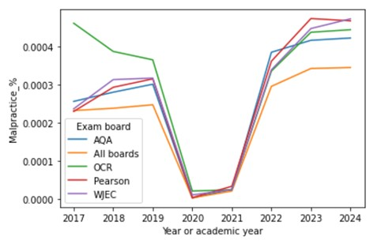

Image 10: % of malpractice cases by exam board

I found it more meaningful to set the malpractice cases in relation to the entries, then only using the count, therefore I create ‘Malpractice_%’ from the count of Malpractice and Entries (image 6 and 10).

##### Dataset Transformation
Then I transformed the dataset from long format by pivot to wide format, so that there are now multiple variables.

##### Data Preparation
I was surprised seeing instead of NaN values a break in pattern during the Covid-19 Pandemic for Malpractice cases. While students received qualification results from the exam boards based on teacher judgement, there were cases with centres not complying with instructions for centre assessed grades (CAG) or students reported to awarding organisations for attempting to gain an unfair advantage. [(Ofqual, 2022)](https://www.gov.uk/government/statistics/malpractice-in-gcse-as-and-a-level-summer-2022-exam-series/background-information-for-malpractice-in-gcse-as-and-a-level-summer-2022-exam-series).
This break in pattern will have an impact on the outcome of the analysis. Thus, I decided to create two data models.

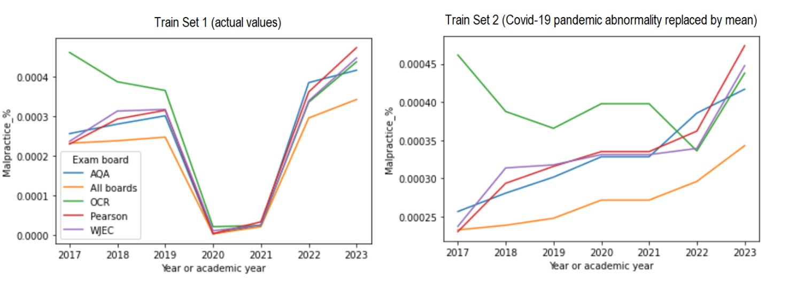

Image 11: Datapoints of the train-datasets

Then splitting it into test data (year 2024) and training data (years 2017-2023), one (train-dataset-1) with the actual figures, including the Covid-19 pandemic abnormalities, and the other (train-dataset-2), replacing those with the mean of its exam board, hoping avoiding introducing a trend in the data as I would with the methods of backfilling or carrying forward (image 11).

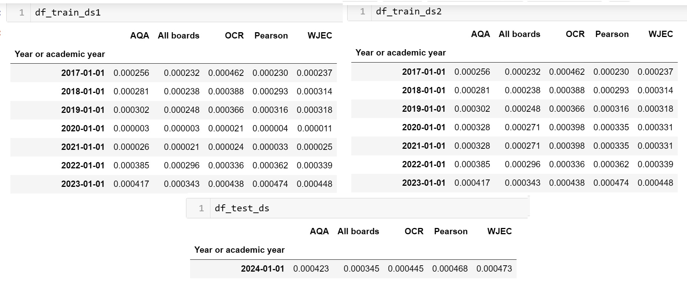

Image 12: Datasets transformed for analysis

I completed preparing the dataset for the analysis by formatting the time element as periodic and placing it into the index (image 12).

#### Modelling
Given its continuous time element, the data is well suited for time series prediction, which is supervised machine learning as the model is trained on existing data. 

The presence of multiple variables, making it a multivariate time series analysis, is new to me. I found guides by [Andrés (2023)](https://mlpills.dev/time-series/step-by-step-guide-to-multivariate-time-series-forecasting-with-var-models/) and [Singh (2018)](https://www.analyticsvidhya.com/blog/2018/09/multivariate-time-series-guide-forecasting-modeling-python-codes/) very helpful to see the similarities and differences to my former univariate time-series analysis.

The simplest multivariate model is the Vector Autoregression model (VAR), which works for datasets with a relationship between the variables, like with weather data, or no relationship, like my data.

Prior to model building, Granger’s causality test can be used to identify the relationship between variables, which is unnecessary for my dataset. 
To help with selecting appropriate data preprocessing and the data model, I checked the data for trend (long-term movements), seasonality (repeating patterns or cycles), and stationarity (constant statistical properties).

##### Trend & Seasonality
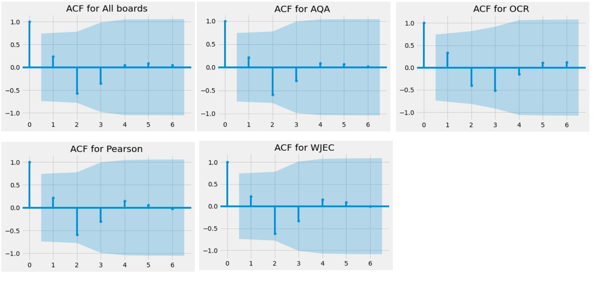

Image 13: ACF results for all variables (train-dataset-1)

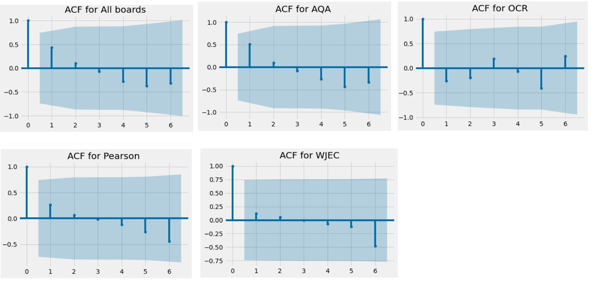

Image 14: ACF results for all variables (train-dataset-2)

The results of the ACF (autocorrelation function) are that here are no slowly decaying correlations (evidence for a trend) on for train dataset 1, but for the variables Pearson and WJEC on data set 2. There are no local maxima at recurring time intervals (evidence for seasonality) for both (images 13 and 14).

##### Stationarity
Using the ADF (Augmented Dickey–Fuller) statistical Hypothesis test, confirming stationarity by rejecting the null hypothesis of at least one unit root in the series.

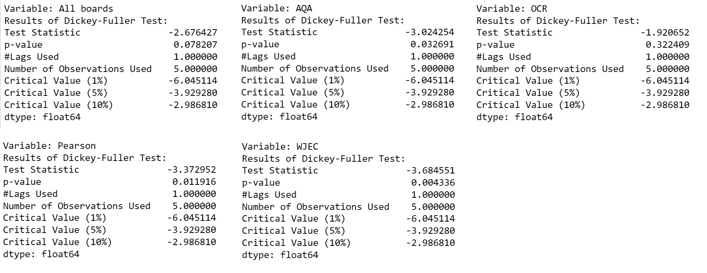

Image 15: ADF results for all variables (train-dataset-1)

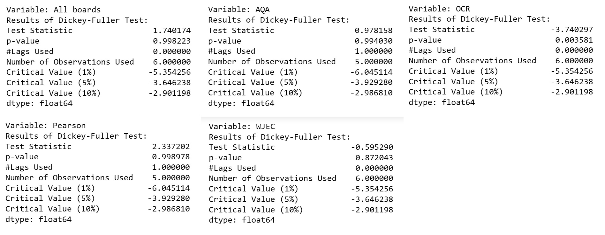

Image 16: ADF results for all variables (train-dataset-2)

For train-dataset-1, the p-values for the variables ‘OCR’ and ‘All boards’ is above 0.05, which means the null hypothesis cannot be rejected, and the series is non-stationary (image 15).

For train-dataset-2, all variables except ‘OCR’ are non-stationary time-series (image 16).

##### Differencing
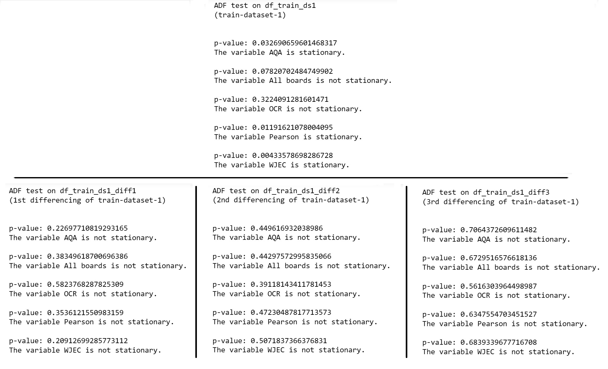

Image 17: Attempt to increase stationarity through differencing (train-dataset-1)

The attempt to make the time-series stationary through differencing failed (image 17).

##### Model Evaluation
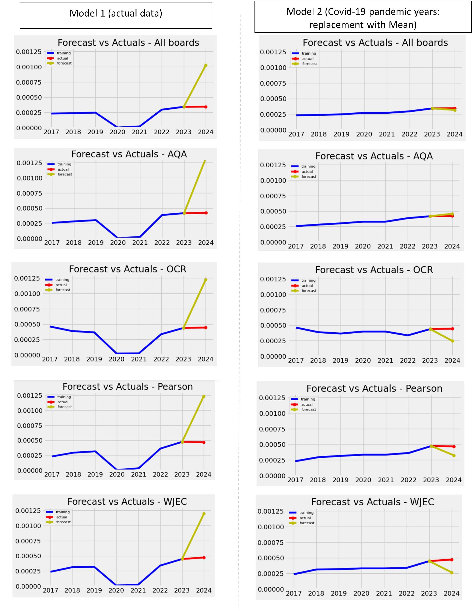

Image 18: Model Evaluation

The success of the model is measured by using part of the dataset not included in the model training dataset, for evaluating a test-predicting. The train/test data split is using the end of the dataset for testing and the beginning for training, thus maintaining the pattern of the data by not splitting it randomly (image 18).

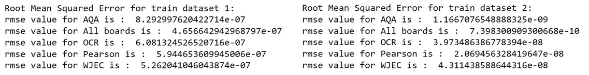

Image 19: Root-Mean-Squared-Error results

Comparing both models, using the RMSE (Root-Mean-Squared-Error) function [(siamii, 2024)](https://stackoverflow.com/questions/17197492/is-there-a-library-function-for-root-mean-square-error-rmse-in-python ), confirmed that the break in pattern of the data of the pandemic years does have an impact on the results of the analysis, as the second model with the Covid-19 numbers being replaced by the training data mean, performed better (image 19).

##### Prediction
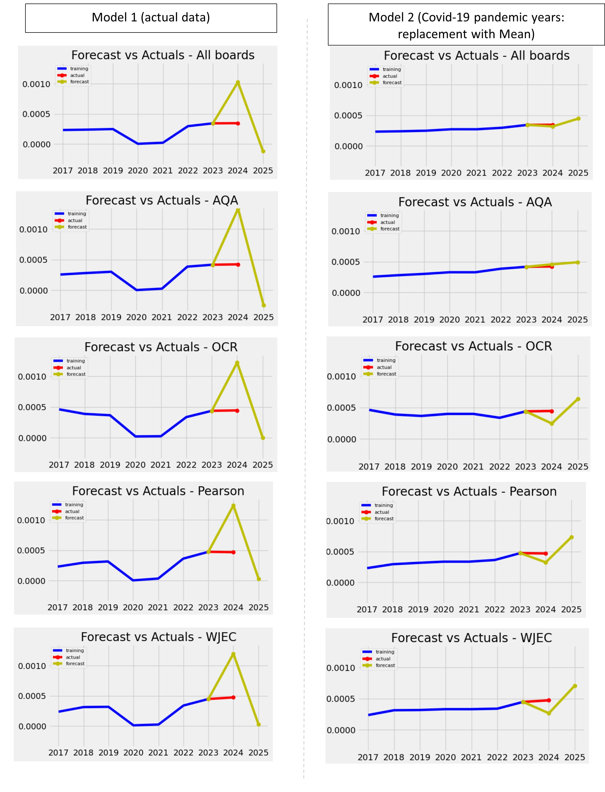

Image 20: Predicting Malpractice_% for year 2025

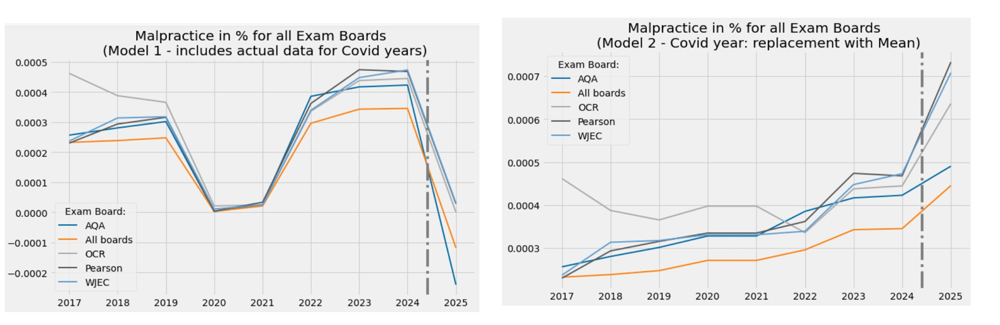

Image 21: Predicting Malpractice_% for year 2025

Using the models to predict Malpractice_% for 2025 displayed a more erratic prognosis for the dataset with the Covid-19 pandemic pattern anomaly (images 20 and 21).

#### Conclusion
##### Results
While the time-series does not contain sufficient datapoints to create trustworthy results, I will apply my learning, and the methods used on multi-variable time-series into a workplace related analysis. Overall, it also has proven that the break in pattern by the Covid-19 Pandemic Years has a substantial impact on the outcome of the analysis, which needs to be dealt with.

##### Limitations
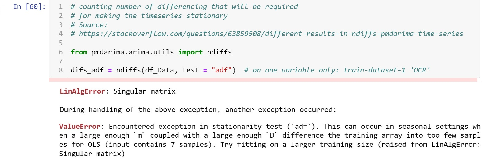

Image 22: Exception when running ndiffs()

The seven-year summary statistic dataset does not provide sufficient datapoints to use most common functions used, as I received exception created while running code, like the one I adapted from Stack Overflow for counting necessary number of differencing [(jmr, 2020)](https://stackoverflow.com/questions/63859508/different-results-in-ndiffs-pmdarima-time-series), confirms the small number of data points an issue for stationary testing and differencing (image 22).

##### Recommendations
The analysis would benefit in create more data points by collecting the data manually from the separate annual reports spanning 2013 to 2024. Thus, will also allow in measuring the Covid-19 Pandemic impact, supporting objective opinions with data when comparing pre-pandemic, pandemic, post-pandemic analysis results.

#### References
Andrés, D. (2023). *Step-by-Step Guide to Multivariate Time Series Forecasting with VAR Models - ML Pills.* [online] Available at: [https://mlpills.dev/time-series/step-by-step-guide-to-multivariate-time-series-forecasting-with-var-models/](https://mlpills.dev/time-series/step-by-step-guide-to-multivariate-time-series-forecasting-with-var-models/) (Accessed 5-Dec-2024)

Government Data Quality Hub (2021), *Meet the data quality dimensions.* [online] GOV.UK. Available at: [https://www.gov.uk/government/news/meet-the-data-quality-dimensions](https://www.gov.uk/government/news/meet-the-data-quality-dimensions) (Accessed: 14-Nov-2024)

jmr (2020). *Different results in ndiffs pmdarima (Time Series).* Stack Overflow. [online] Available at: [https://stackoverflow.com/questions/63859508/different-results-in-ndiffs-pmdarima-time-series](https://stackoverflow.com/questions/63859508/different-results-in-ndiffs-pmdarima-time-series) (Accessed 15-Jan-2025)

Ofqual (2022). *Background information for malpractice in GCSE, AS and A level: summer 2022 exam series.* [online] GOV.UK. Available at: [https://www.gov.uk/government/statistics/malpractice-in-gcse-as-and-a-level-summer-2022-exam-series/background-information-for-malpractice-in-gcse-as-and-a-level-summer-2022-exam-series](https://www.gov.uk/government/statistics/malpractice-in-gcse-as-and-a-level-summer-2022-exam-series/background-information-for-malpractice-in-gcse-as-and-a-level-summer-2022-exam-series) (Accessed 20 Nov 2024).

Ofqual Analytics (n.d.). *Summary statistics.* [online] Available at: [https://analytics.ofqual.gov.uk/apps/GCSEandGCE/SummaryStats/](https://analytics.ofqual.gov.uk/apps/GCSEandGCE/SummaryStats/) (Accessed 30-Oct-2024 and 7-Jan-2024)

siamii (2024). *Is there a library function for Root mean square error (RMSE) in python?* [online] Stack Overflow. Available at: [https://stackoverflow.com/questions/17197492/is-there-a-library-function-for-root-mean-square-error-rmse-in-python](https://stackoverflow.com/questions/17197492/is-there-a-library-function-for-root-mean-square-error-rmse-in-python) (accessed 18-Jan-2025)

Singh, A. (2018). *A Multivariate Time Series Guide to Forecasting and Modeling (with Python codes).* [online] Analytics Vidhya. Available at: [https://www.analyticsvidhya.com/blog/2018/09/multivariate-time-series-guide-forecasting-modeling-python-codes/](https://www.analyticsvidhya.com/blog/2018/09/multivariate-time-series-guide-forecasting-modeling-python-codes/) (accessed 5-Dec-2024)

The National Archives (2019). *Open Government Licence.* [online] Nationalarchives.gov.uk. Available at: [https://www.nationalarchives.gov.uk/doc/open-government-licence/version/3/](https://www.nationalarchives.gov.uk/doc/open-government-licence/version/3/) (Accessed 30-Oct-2024)

